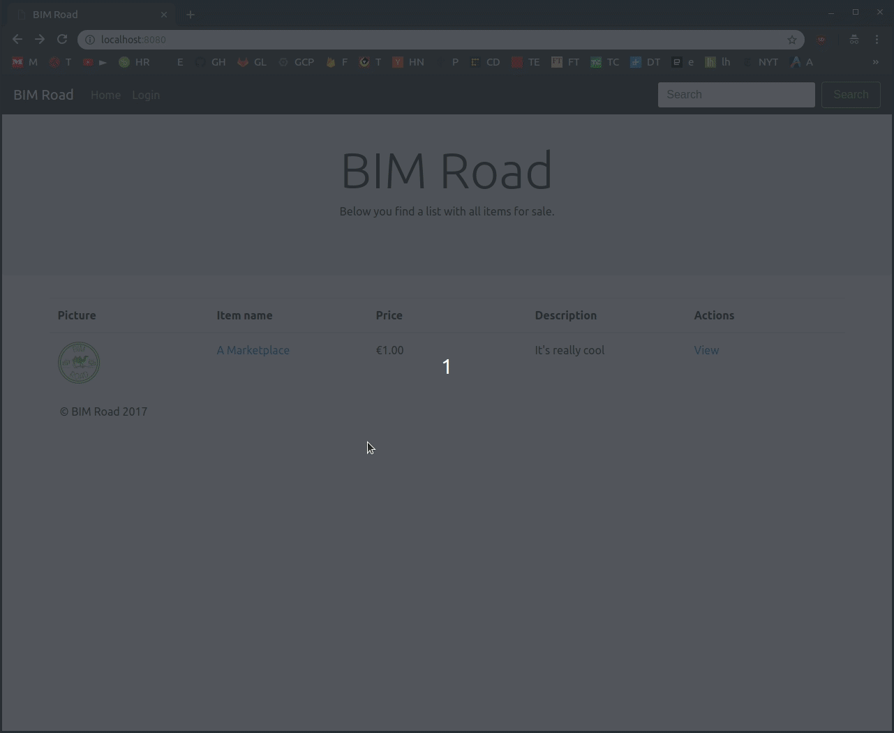

# BIMRoad

Online marketplace written in JavaEE based on Servlets and H2.


Built by [Sverrevh](https://github.com/sverrevh) and me as a University project.

[](https://deploy.cloud.run/?git_repo=https://github.com/danacr/BIMRoad.git)

Alternatively, run this command inside your Google Cloud shell:

```
cloudshell_open --repo_url "https://github.com/danacr/BIMRoad.git" --page "editor"
```

Getting started:

Run: `docker-compose up`

Admin account details:

```
email: admin@bimroad.org
password: password
```

Website will be available at `localhost:8080`

Demo:


Visiting `localhost:8082` will reveal the reverse tunnel address. (Other's can access the website at that link without the need of any port-forwarding)

Build: `docker build . --tag danacr/bimroad`

Useful commands:

```
java -cp h2-1.4.199.jar org.h2.tools.Script -url jdbc:h2:file:./h2 -script 'h2backup.sql'
target/dependency/h2-1.4.200.jar
java -jar tools/webapp-runner.jar target/BIMRoad-1.0-SNAPSHOT --port 9090
java -cp target/dependency/h2-*.jar org.h2.tools.RunScript -url jdbc:h2:file:./h2new -script tools/h2backup.sql
mvn install
mvn clean package
```
