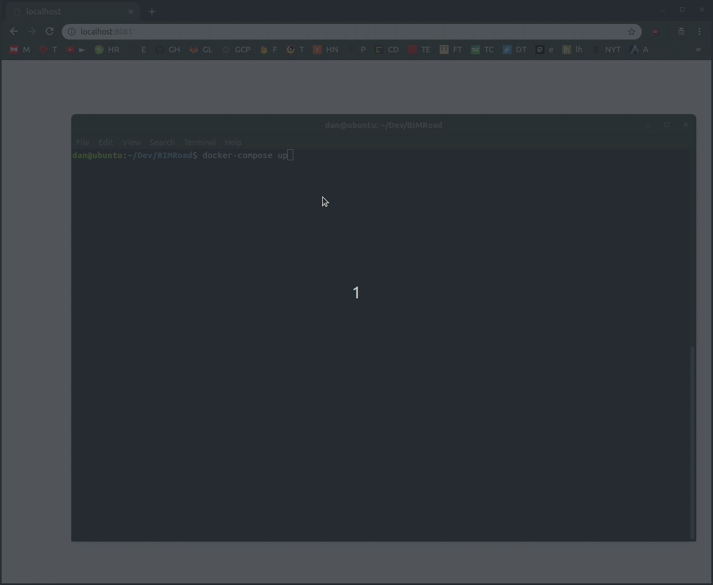

# BIMRoad

Online marketplace written in JavaEE based on Servlets and MySQL.


Built by [Sverrevh](https://github.com/sverrevh) and me as a University project.

Getting started:


Run: `docker-compose up` (first run may take a bit, wait for mysqld to be ready on 3306)

Create the `marketplace` database in MariaDB (adminer is running on `localhost:8081`) and import the `marketplace.sql`.

```
System: MySQL
Server: mariadb
Username: root
Password: password
Database: (leave blank)
```

Admin account details (becomes available after importing the sql):

```
email: admin@bimroad.org
password: password
```

Website will be available at `localhost:8080`

Demo:


Visiting `localhost:8082` will reveal the reverse tunnel address. (Other's can access the website at that link without the need of any port-forwarding)

Build: `docker build . --tag danacr/bimroad`

Useful commands:

```
java -cp h2-1.4.199.jar org.h2.tools.Script -url jdbc:h2:file:./h2 -script 'h2backup.sql'
target/dependency/h2-1.4.200.jar
java -jar tools/webapp-runner.jar target/BIMRoad-1.0-SNAPSHOT --port 9090
java -cp target/dependency/h2-*.jar org.h2.tools.RunScript -url jdbc:h2:file:./h2new -script tools/h2backup.sql
mvn install
mvn clean package
```
